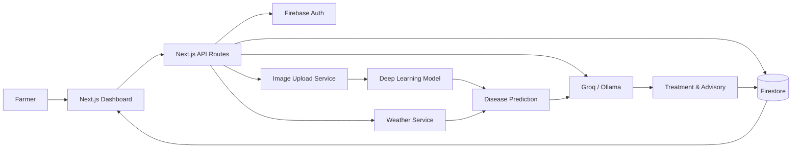
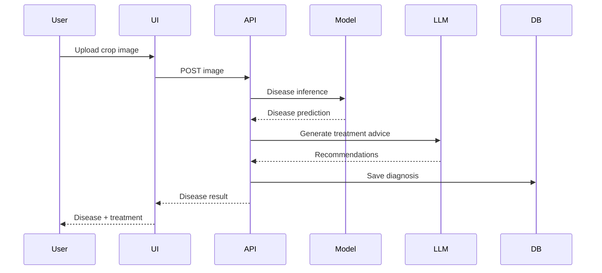
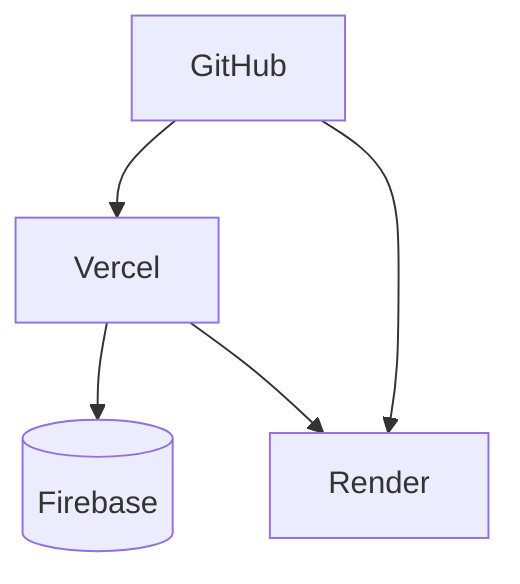

# 🌾 SmartCrop AI

> **AI-Powered Crop Disease Detection Platform for Indian Agriculture**

SmartCrop AI helps farmers identify crop diseases instantly using artificial intelligence. Farmers can upload a photo of an infected plant, and the system analyzes symptoms, detects possible diseases, estimates severity, and provides actionable treatment recommendations.

The platform combines computer vision, machine learning, weather intelligence, and agricultural knowledge to support early disease detection and reduce crop losses.

---

## ✨ Features

* 📸 **Plant Disease Detection** — Upload crop images for instant diagnosis
* 🤖 **AI-Powered Classification** — Deep learning models identify diseases with confidence scores
* 🌦️ **Weather-Aware Insights** — Weather conditions used to assess disease risk
* 📍 **Auto Location Detection** — GPS-based location support with IP fallback
* ⚠️ **Disease Severity Analysis** — Detects infection level and urgency
* 💊 **Treatment Recommendations** — Suggests preventive and corrective measures
* 📊 **Analytics Dashboard** — Disease trends and detection statistics
* 🗂️ **Detection History** — Stores previous diagnoses for future reference
* 🔒 **Secure Authentication** — Firebase Authentication and protected routes
* 🌐 **Multi-Crop Support** — Detect diseases across various crops

---

## 🏗️ Architecture



The application follows a split execution architecture:

| Layer           | Technology                | Role                               |
| --------------- | ------------------------- | ---------------------------------- |
| Frontend        | Next.js 14 App Router     | UI and routing                     |
| Computer Vision | TensorFlow / PyTorch      | Disease detection                  |
| AI Inference    | Groq / Ollama             | Treatment explanation and advisory |
| Backend API     | Next.js API Routes        | Request orchestration              |
| Auth & Database | Firebase Auth + Firestore | User management and storage        |
| Styling         | Tailwind CSS              | Responsive interface               |

---

## 🚀 Quick Start

### Prerequisites

* Node.js 18+
* Python 3.10+
* Firebase Project (Auth + Firestore)
* OpenWeatherMap API Key
* Groq API Key (or local Ollama)
* Plant Disease Dataset

---

### 1. Clone Repository

```bash
git clone https://github.com/AGTechathon-2-0/NullPointer
cd SmartCrop_AI
```

---

### 2. Install Frontend Dependencies

```bash
npm install
```

---

### 3. Configure Environment Variables

Create `.env.local`

```env
NEXT_PUBLIC_APP_NAME=SmartCrop AI
NEXT_PUBLIC_APP_URL=http://localhost:3000

# Firebase
NEXT_PUBLIC_FIREBASE_API_KEY=
NEXT_PUBLIC_FIREBASE_AUTH_DOMAIN=
NEXT_PUBLIC_FIREBASE_PROJECT_ID=
NEXT_PUBLIC_FIREBASE_STORAGE_BUCKET=
NEXT_PUBLIC_FIREBASE_MESSAGING_SENDER_ID=
NEXT_PUBLIC_FIREBASE_APP_ID=

FIREBASE_ADMIN_PROJECT_ID=
FIREBASE_ADMIN_CLIENT_EMAIL=
FIREBASE_ADMIN_PRIVATE_KEY=

# Weather
OPENWEATHER_API_KEY=

# Disease Detection Service
ML_SERVICE_URL=http://localhost:8000
ML_SECRET_HEADER_KEY=

# LLM
GROQ_API_KEY=
LLM_PROVIDER=groq

# Optional Ollama
OLLAMA_BASE_URL=http://localhost:11434
OLLAMA_MODEL=mistral
```

---

### 4. Start Disease Detection Service

```bash
cd ml-service

pip install -r requirements.txt

python train.py

uvicorn main:app --reload --port 8000
```

Create `ml-service/.env`

```env
ENV=development
PORT=8000
SECRET_HEADER_KEY=
ALLOWED_ORIGINS=http://localhost:3000
```

---

### 5. Start Next.js Application

```bash
npm run dev
```

Open:

```text
http://localhost:3000
```

---

## 📁 Repository Structure

```text
SmartCrop_AI/
├── app/
│   ├── page.tsx
│   ├── dashboard/page.tsx
│   ├── history/page.tsx
│   ├── analytics/page.tsx
│   ├── login/page.tsx
│   ├── register/page.tsx
│   └── api/
│       ├── detect-disease/route.ts
│       ├── treatment/route.ts
│       ├── weather/route.ts
│       ├── history/route.ts
│       ├── analytics/route.ts
│       └── user/route.ts
│
├── components/
│   ├── disease/
│   │   ├── ImageUploader.tsx
│   │   ├── DiseaseResultCard.tsx
│   │   ├── SeverityMeter.tsx
│   │   └── TreatmentPanel.tsx
│
├── hooks/
│   ├── useDiseaseDetection.ts
│   ├── useLocation.ts
│   └── useWeather.ts
│
├── lib/
│   ├── firebase/
│   ├── services/
│   │   ├── diseaseService.ts
│   │   ├── weatherService.ts
│   │   └── treatmentService.ts
│
├── ml-service/
│   ├── main.py
│   ├── predict.py
│   ├── train.py
│   ├── data/
│   └── models/
│
├── tests/
├── types/
└── middleware.ts
```

---

## 🔄 How It Works

### Disease Detection Workflow



---

## 🧠 AI Pipeline

### Input

```json
{
  "image": "crop_leaf.jpg",
  "location": {
    "lat": 19.07,
    "lon": 72.87
  },
  "crop": "Tomato"
}
```

### Output

```json
{
  "disease": "Tomato Early Blight",
  "confidence": 96.4,
  "severity": "Moderate",
  "riskLevel": "Medium",
  "treatment": [
    "Remove infected leaves",
    "Apply recommended fungicide",
    "Improve air circulation"
  ]
}
```

---

## 🗄️ Firebase Data Model

| Collection                | Description                   |
| ------------------------- | ----------------------------- |
| `users/{userId}`          | Farmer profile                |
| `diagnoses/{diagnosisId}` | Disease detection records     |
| `weatherCache/{lat_lon}`  | Weather cache                 |
| `diseaseAnalytics/`       | Aggregated disease statistics |

---

## 📊 Analytics

The dashboard provides:

* Most detected diseases
* Disease frequency by crop
* Seasonal outbreak trends
* Detection accuracy metrics
* Severity distribution charts

---

## 🧪 Testing

```bash
npm test

npm run lint
```

Coverage includes:

* Disease detection API
* Image upload components
* Treatment recommendation service
* Weather integration
* Analytics routes

---

## 📦 Deployment

| Component                 | Platform                  |
| ------------------------- | ------------------------- |
| Next.js Application       | Vercel                    |
| Firebase Auth & Firestore | Firebase                  |
| Disease Detection API     | Render / Railway / Fly.io |



---

## 🛣️ Roadmap

* [x] Disease detection MVP
* [x] Treatment recommendation engine
* [ ] Real-time camera scanning
* [ ] Disease severity segmentation
* [ ] Multilingual support
* [ ] Voice-based farmer assistant
* [ ] WhatsApp disease alerts
* [ ] Offline/PWA support
* [ ] Government agriculture scheme integration

---

## 🔒 Security

* Firebase Admin credentials remain server-side
* Image uploads validated before processing
* Zod schema validation for all APIs
* Protected routes via Firebase Authentication
* Per-user data isolation using Firestore rules
* Secure ML service communication

---

## 📄 License

This project is intended as a hackathon MVP and academic prototype. Disease predictions should be validated by agricultural experts before production deployment.

---

<p align="center">
Built By Siddhant Gosavi | Aditya Aryan | Prathamesh Chougale | Aditya Budhale
</p>
<p align="center">
AGTechathon 2.0 - AG Patil Institute of Technology, Solapur
</p>
